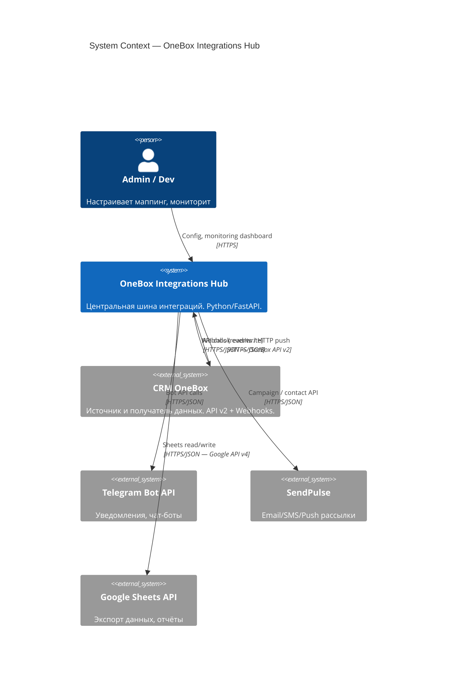
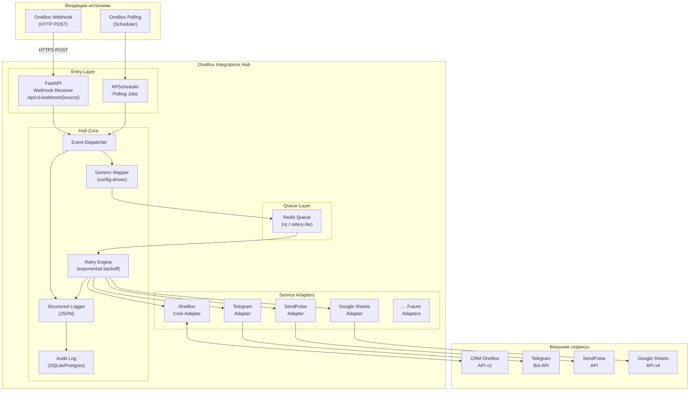
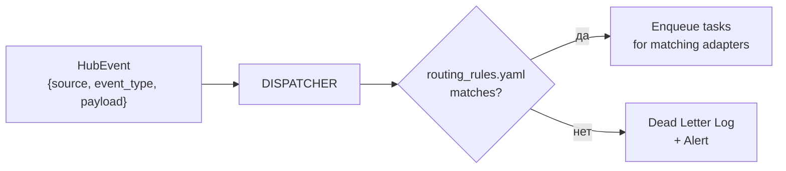

# ARCHITECTURE: OneBox Integrations Hub

**Version:** 1.0  
**Date:** 2026-03-09  
**Status:** APPROVED  
**Author:** Architect Agent

---

## 1. Обзор системы

OneBox Integrations Hub — централизованная шина интеграций между CRM OneBox и внешними сервисами (Telegram, SendPulse, Google Sheets и др.).

**Основной принцип:** Hub — единственная точка обмена данными. Ни OneBox, ни внешние сервисы не знают друг о друге напрямую.

---

## 2. Границы системы (System Boundary)



**Что входит в систему (in scope):**
- Приём вебхуков от OneBox
- Опрос OneBox API (polling) при необходимости
- Маппинг и трансформация данных
- Вызов внешних сервисов через адаптеры
- Retry-механизм, логирование, audit trail

**Что вне системы (out of scope):**
- UI для конечных пользователей OneBox
- Хранение бизнес-данных CRM
- Разработка самих Telegram-ботов или SendPulse шаблонов

---

## 3. Высокоуровневая архитектура



---

## 4. Hub Core — детальное описание

### 4.1 Entry Layer

| Компонент | Технология | Назначение |
|---|---|---|
| Webhook Receiver | FastAPI | Принимает HTTP POST от OneBox, валидирует подпись (HMAC), возвращает 200 немедленно |
| Polling Scheduler | APScheduler | Регулярный опрос OneBox API для pull-based интеграций |

**Принцип:** Entry Layer не выполняет бизнес-логику. Только валидация + постановка в очередь.

### 4.2 Event Dispatcher

Принимает нормализованный `HubEvent`, определяет маршрут:
- Какой адаптер (или несколько) должен обработать событие
- Порядок вызова (параллельно или последовательно)
- Конфигурация берётся из `routing_rules.yaml`



### 4.3 Generic Mapper

Config-driven трансформация полей по схемам.

**Источник конфига:** `config/mappings/{integration_name}.yaml`

**Принцип:** Новый маппинг — новый YAML-файл, без изменения кода.

### 4.4 Retry Engine

- Стратегия: экспоненциальный backoff (1s → 2s → 4s → 8s → max 5 попыток)
- При исчерпании попыток: запись в `dead_letter_queue` + структурированный алерт

### 4.5 Structured Logger + Audit

- Формат: JSON Lines
- Audit Log: таблица `audit_events` в БД — хранит полный payload запроса/ответа

---

## 5. Adapter Layer — паттерн

Все адаптеры реализуют единый интерфейс `BaseAdapter`.

**Принцип Open-Closed:** новый сервис = новый класс-наследник `BaseAdapter`. Ядро Hub не изменяется.

---

## 6. Структура проекта

```
onebox-integrations-hub/
├── src/
│   ├── main.py                    # FastAPI app entry point
│   ├── core/                      # Dispatcher, Mapper, Retry, Logger
│   ├── adapters/                  # OneBox, Telegram, SendPulse, GSheets
│   ├── api/                       # Routes for webhooks & health
│   ├── scheduler/                 # Polling jobs
│   └── config/                    # Settings & loaders
├── config/                        # YAML mappings & routing rules
├── tests/                         # Unit & Integration tests
├── docker/                        # Dockerfile & Compose
└── docs/                          # Architecture, Decisions, Backlog
```

---

*Source of Truth: projects/onebox-integrations-hub/docs/01-architecture/ARCHITECTURE.md*  
*Created: 2026-03-09*
