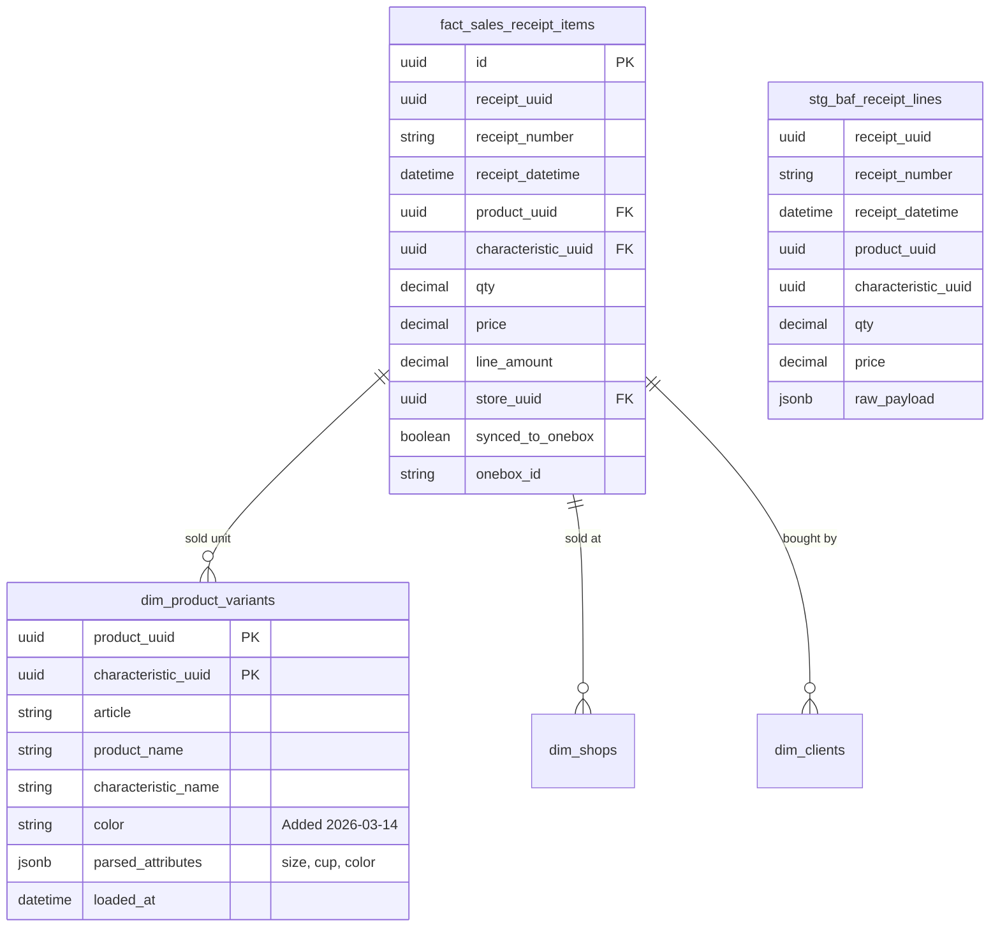

# DB_SCHEMA: OneBox Integrations Hub

**Version:** 1.1  
**Date:** 2026-03-12  
**Status:** APPROVED
**Author:** Integrations Hub Architect

---

## 1. Overview
Database schema for OneBox Integrations Hub (PostgreSQL). 
Architecture follows a **Star Schema** approach for Data Warehouse:
- `stg_*`: Staging area for raw data from 1C.
- `dim_*`: Dimension tables (Products, Clients, Shops).
- `fact_*`: Fact tables for sales and analytics.

---

## 2. Entity Relationship Diagram

---

## 3. Dimension Tables

### 3.1 `dim_product_variants`
The sellable unit in Secret Shop context.
- **Natural Key:** `(product_uuid, characteristic_uuid)`.
- **Fields:** article, product_name, characteristic_name.

---

## 4. Fact Tables

### 4.1 `fact_sales_receipt_items`
Detailed sales records. One row per receipt line.
- **Source:** Joined data from `receipt_lines` + `product_catalog`.

---

*Source of Truth: projects/onebox-integrations-hub/docs/01-architecture/DB_SCHEMA.md*
